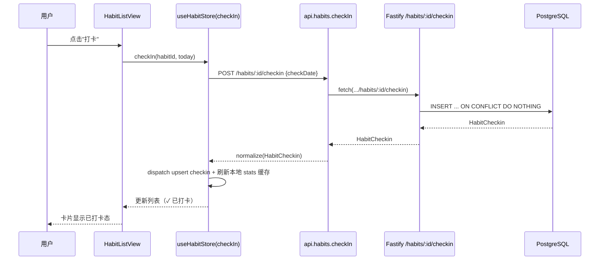
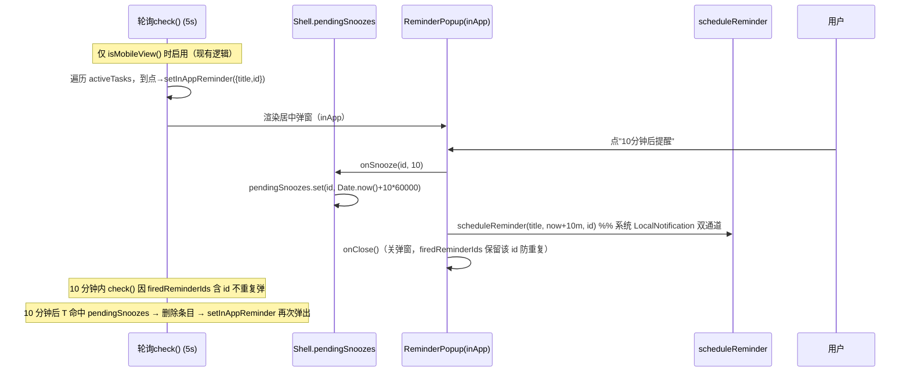
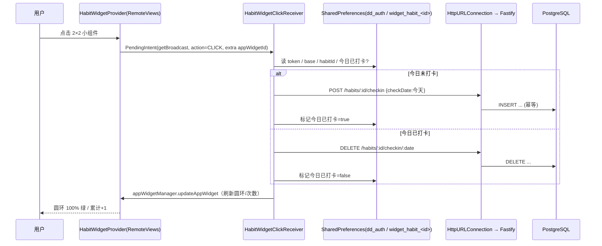
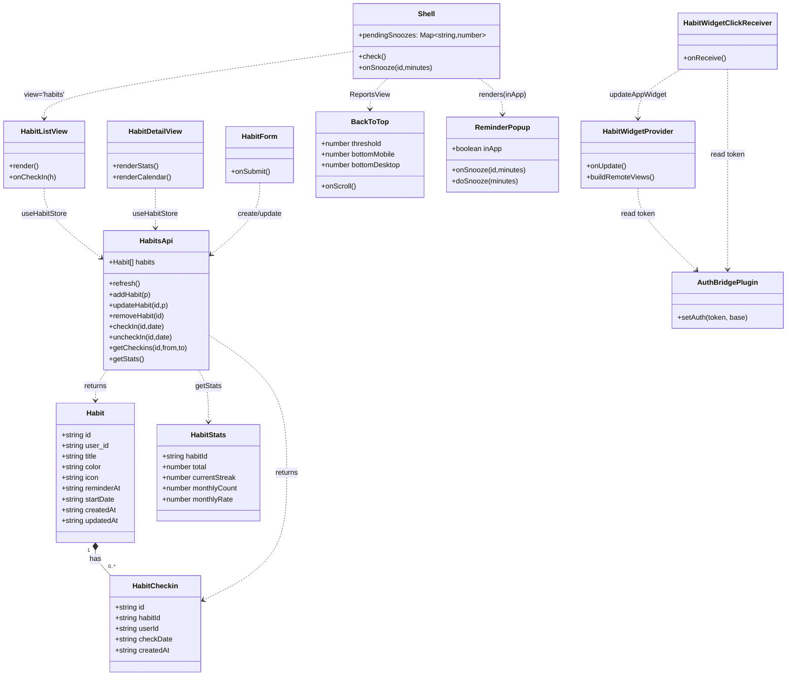

# 🐮🐴的打工日志 · 增量架构设计与任务分解

> 编制：架构师 高见远（Gao）｜日期：2026-08-24｜版本：v1.0
> 配套 PRD：`deliverables/software-company/dave-diver-incremental-prd.md`
> 技术栈：**Vite + React 18 + TypeScript + Electron（PC exe）+ Capacitor 6（Android apk）+ Fastify 4 + PostgreSQL**

---

## 0. 决策摘要（先读这个）

| 项 | 默认决策 |
| --- | --- |
| 新增依赖 | **零新增 npm / gradle 依赖**。全部复用现有技术栈；Android 小组件用原生 `RemoteViews`（Java），不引入 Kotlin / Glance。 |
| 鉴权复用 | `/habits*` 直接复用 `server/tasks.ts` 在根实例注册的 `preHandler` JWT 钩子（已对所有路由生效），`habits.ts` 不再单独加钩子。 |
| 移动端提醒弹窗 | 修复 `App.tsx` 未传 `inApp` 的既有 bug；"10分钟后提醒"通过 `Shell` 内 `pendingSnoozes` ref 驱动应用内轮询在 10 分钟后再次弹窗（同时保留系统 LocalNotification）。 |
| Electron 启动动画 | 采用**独立 SplashWindow** 方案（非内嵌首屏），加载 `public/splash.html`（Vite 自动拷贝到 `dist/`），主窗口 `did-finish-load` 后销毁。 |
| Android 小组件 | 新建 **2×2 `RemoteViews` 圆形小组件**（Java `AppWidgetProvider`），点击 `PendingIntent`（广播）→ `BroadcastReceiver` 读原生 `SharedPreferences` 中的 token → `HttpURLConnection` 切换打卡 → 刷新本件。 |
| 原生 token 存储 | 新增极简 Capacitor 插件 `AuthBridgePlugin`（Java，`@PluginMethod setAuth`）把 token/base 写入原生 `SharedPreferences`，App 登录后调用（对齐 `electronAPI.setAuth`）。小组件与配置页读同一份。 |
| 习惯数据来源图标 | 复用现有 emoji 池（默认 `🔥`，可选一组习惯 emoji），**不做自定义上传**。 |
| 跨天判定 | 以**设备本地日期**为准（客户端算 `YYYY-MM-DD` 传给后端）；打卡幂等（唯一约束 `habit_id+check_date`），多端"最后操作胜出"。 |
| 提醒冲突 | habit 与 task 提醒**独立弹出、互不合并**；应用内轮询一次只弹一个（现有逻辑），关掉一个再弹下一个。 |
| 卡片"更饱满" | **仅在现有四段内容内优化排版**（间距/字号/色彩/空状态/按态），不新增"创建时间/截止日期"等字段。 |
| 返回顶部常驻 | 本期**仅报告页**（`ReportsView`）加返回顶部；组件做成通用，后续可复用。 |
| "桌面小组件展示习惯" | 指 **Android 2×2 圆形小组件**本身即展示所选习惯的名称+累计次数（即 P1 两个小组件条目是同一交付物），**不改动 Electron 桌面小组件**。 |

---

## 1. 实现方案概述 + 框架选型

### 1.1 技术难点与选型

| 难点 | 方案 | 理由 |
| --- | --- | --- |
| 5 项功能横跨 Web/Electron/Android 三端 | 复用现有 `src/`（Web 同一份代码打进 Electron + Capacitor）、`server/`、`electron/`、`android/` 四层结构，**不拆仓、不引重框架** | 现有工程已具备三端一体化构建（`cap:sync` / `build:electron`），改动应当"就地落入"现有分层。 |
| 习惯打卡云端存储 | 后端新增 2 张表 + 7 个路由（Fastify + pg），前端 `useHabits` hook + `habitsStore` 完全镜像 `useReports`/`reportsStore` | 字段命名、归一化、鉴权、刷新语义与现有 `reports` 100% 一致，工程师可照抄模式，降低出错面。 |
| 移动端应用内强提醒 + 10 分钟后再弹 | 在 `Shell` 内新增 `pendingSnoozes: useRef<Map<id, ts>>`，扩展既有 5s 轮询 `check()` | 复用现有"到点轮询 + `firedReminderIds`"双通道机制；不新建定时器体系。`ReminderPopup` 加 `onSnooze` 回调，桌面独立窗口路径保持不变。 |
| Android 圆形小组件 | **`RemoteViews` + `AppWidgetProvider`（Java）**，圆形外观用 `FrameLayout` + 圆环 `ProgressBar` + 居中文本；点击用 `PendingIntent.getBroadcast` | 现有 `MainActivity.java` 是 Java；引入 Kotlin/Glance 需改 `build.gradle` + 加 `androidx.glance` 依赖，MVP 成本过高。`RemoteViews` 零新依赖、与现有工程同语言。 |
| 小组件离线/冷启动也能打卡 | token 经极简 Capacitor 插件落地原生 `SharedPreferences`；小组件 `BroadcastReceiver` 用 `HttpURLConnection` 直连 API | 避免依赖 WebView 存活；无新依赖；与 Electron 端 `authFile` 思路一致（原生侧存凭证）。 |
| 启动动画三端统一 | Android 替换 `drawable*/splash.png` 为橘黄墨镜牛马图标（源 `public/icon.png`，背景 `#d7ece4`）；Electron 新增 `SplashWindow` 加载 `public/splash.html` | 各自走平台原生启动屏机制，品牌资源统一取自 `public/icon.png`。 |

### 1.2 架构模式

- 前端：**Context + useReducer 状态层**（`habitsStore`/`useHabitStore` 镜像 `reportsStore`/`useReportStore`）。
- 后端：**Fastify 插件化路由**（`registerHabits(app)`），全局 `preHandler` JWT 钩子复用。
- 原生：**Capacitor Plugin（原生桥）+ AppWidgetProvider（小组件）**，通过原生 `SharedPreferences` 解耦 WebView 生命周期。

---

## 2. 文件清单（相对路径 + 改动类型 + 要点）

### 2.1 后端 `server/`

| 文件 | 类型 | 要点 |
| --- | --- | --- |
| `server/habits.ts` | **新增** | `registerHabits(app)`：7 个路由（见 §3）。复用 `pool`（`db.ts`）、`snake_case` 列名、与 `tasks.ts` 一致的参数映射。**不自带鉴权钩子**（复用根实例钩子）。 |
| `server/index.ts` | 修改 | `import { registerHabits } from './habits.js'`；在 `registerTasks(app)` 之后、`registerReports(app)` 之前调用 `await registerHabits(app)`。 |
| `server/migrate.cjs` | 修改 | 在 reports 迁移段之后追加：`CREATE TABLE IF NOT EXISTS habits / habit_checkins` + 3 个 `CREATE INDEX IF NOT EXISTS`，全部幂等。命名/风格与现有 ALTER 段一致。 |
| `server/schema.sql` | 修改 | 追加 `habits`/`habit_checkins` 建表 + 索引（供新环境 `psql -f` 直建）。 |

### 2.2 前端 `src/`

| 文件 | 类型 | 要点 |
| --- | --- | --- |
| `src/types.ts` | 修改 | 追加 `Habit`、`HabitCheckin`、`HabitStats` 接口（camelCase，字段见 §3）。 |
| `src/lib/api.ts` | 修改 | `api` 对象内新增 `habits` 分组：`listHabits / createHabit / getHabit / updateHabit / deleteHabit / checkIn / uncheckIn / getCheckins / getStats`，全部走 `apiFetch`。 |
| `src/hooks/useHabits.ts` | **新增** | 镜像 `useReports`：`normalize`、reducer、`refresh/addHabit/updateHabit/removeHabit/checkIn/uncheckIn/getCheckins/getStats`。**离线缓存**：成功刷新写 `localStorage['dd_habits']`；失败读缓存；打卡离线进 `localStorage['dd_habit_queue']`，下次刷新前 flush。 |
| `src/store/habitsStore.tsx` | **新增** | `HabitsProvider` + `useHabitStore`（完全镜像 `reportsStore.tsx`）。 |
| `src/components/HabitListView.tsx` | **新增** | 底部导航"习惯"页：列表项=左图标/色块 + 中名称与今日状态 + 右"打卡"按钮（已打卡显 ✓）；顶部"新建习惯"；进入详情。 |
| `src/components/HabitDetailView.tsx` | **新增** | 顶部 2×2 统计卡（月打卡/总打卡/月完成率/当前连续）；中部月历（圆形日期，当天蓝边、已打卡填充品牌绿）；底部当月打卡日志；今日打卡/取消按钮。 |
| `src/components/HabitForm.tsx` | **新增** | 创建/编辑习惯：名称（必填）、图标 emoji 选择、颜色、每日提醒时间（`type=time`）、开始日期（`type=date`，默认今天）。 |
| `src/components/BackToTop.tsx` | **新增** | 通用返回顶部组件：`props { threshold=400, bottomMobile=80, bottomDesktop=24, zIndex=35 }`；监听 `window` 滚动，`scrollY>threshold` 显隐（200ms 过渡）；点击 `window.scrollTo({top:0,behavior:'smooth'})`。 |
| `src/App.tsx` | 修改 | （1）`Shell` 增加 `view: 'habits'` 分支，渲染 `<HabitsProvider><HabitListView/></HabitsProvider>`；（2）底部 tab 增加"习惯"按钮；（3）修复移动端提醒弹窗：`<ReminderPopup inApp title onClose onSnooze>`；（4）新增 `pendingSnoozes` ref + 扩展轮询 `check()` 实现"10分钟后"再弹；（5）habit 提醒纳入轮询；（6）`AuthBridgePlugin` 登录后桥接 token。 |
| `src/components/ReminderPopup.tsx` | 修改 | 新增 `onSnooze?:(id,minutes)=>void`；`inApp` 模式下"10分钟后提醒"改调 `onSnooze(id,10)`（同时保留桌面独立窗口的 `doSnooze`）；`inApp` 模式隐藏"延期"展开器与右上角 ✕（仅留「知道了」「10分钟后提醒」两按钮）；新增 `.in-app` 居中遮罩分支。 |
| `src/components/ReportsView.tsx` | 修改 | 末尾 `<BackToTop />`。 |
| `src/components/TaskCard.tsx` | 修改 | 仅微调：统一四段式结构不动；`padding` 改为 `14px 14px 14px 10px`；无步骤时隐藏步骤区、无标签时隐藏标签区（已有 `hasSteps`/`tags.map`，确保空数组不渲染占位）；完善 `aria-label`。 |
| `src/index.css` | 修改 | ① `.reminder-popup.in-app` 居中遮罩 + `.reminder-card` 卡片样式（≤320px、遮罩 `rgba(0,0,0,0.55)`、按钮 ≥16px）；② `.back-to-top` 圆形 44px 品牌绿、移动端 `bottom:80px`/桌面 `bottom:24px`、200ms 过渡；③ `.task-card` 间距/字号/空状态/按态完善 + `[data-theme="dark"]` 对应覆盖；④ `.habit-*` 列表/详情/日历/表单样式（圆角 `var(--radius)`、底色 `var(--card)`、`[data-theme="dark"]` 覆盖）；⑤ `public/splash.css` 由本文件或独立文件提供（见下）。 |

### 2.3 静态资源 `public/`

| 文件 | 类型 | 要点 |
| --- | --- | --- |
| `public/splash.html` | **新增** | Electron 启动窗极简页：居中橘黄墨镜牛马图标（`` 或内联 SVG）+ 底部加载点；引用 `./splash.css`。Vite 自动拷贝到 `dist/splash.html`。 |
| `public/splash.css` | **新增** | 背景 `#d7ece4`、图标呼吸动画 `splash-breathe`、加载点动画。 |

### 2.4 Electron `electron/`

| 文件 | 类型 | 要点 |
| --- | --- | --- |
| `electron/main.ts` | 修改 | 新增 `createSplashWindow()`（400×400、`frame:false`、`backgroundColor:'#d7ece4'`、`transparent:false`，加载 `path.join(app.getAppPath(),'dist','splash.html')`）；`app.whenReady().then` 先 `createSplashWindow()`；主窗口 `new BrowserWindow({... show:false})`，监听 `did-finish-load` → `splashWin?.destroy(); mainWin.show()`。注意 `electron-builder.json` 的 `files:["dist/**/*",...]` 已含 `dist/splash.html`。 |
| `electron/preload.ts` | 修改 | 暴露 `authBridge: { setAuth(token, base) }` → `ipcRenderer.invoke('auth:set-native', {token, base})`（供 `AuthBridgePlugin` 之外的 Electron 端也走同一路径；Electron 端无原生插件，直接写 `authFile`，保持现有 `electronAPI.setAuth` 不变即可，**本项可选**，仅当统一调用入口需要时加）。 |

> 说明：`AuthBridgePlugin` 是 **Android 原生** 插件（见 §2.5）。Electron 端仍走现有 `electronAPI.setAuth`（写 `widget-auth.json`），无需改动。

### 2.5 Android `android/`

> 现有 `android/app/src/main/java/com/davediver/tasks/` 仅有 `MainActivity.java`（继承 `BridgeActivity`），**无既有 widget 工程，全部新增**。

| 文件 | 类型 | 要点 |
| --- | --- | --- |
| `.../MainActivity.java` | 修改 | 在 `onCreate` 注册 `AuthBridgePlugin`（`registerPlugin(AuthBridgePlugin.class)` 或 Capacitor 6 的 `bridge.addPlugin`/注解自动发现——见 §3.4 代码骨架）。 |
| `.../AuthBridgePlugin.java` | **新增** | Capacitor 6 `@CapacitorPlugin(name="AuthBridge")` + `@PluginMethod setAuth`，把 `token`/`base` 写入 `SharedPreferences`（`"dd_auth"`，key `token`/`base`）。 |
| `.../HabitWidgetProvider.java` | **新增** | `extends AppWidgetProvider`：`onUpdate` 读取该 widget 绑定的 habitId（来自 `SharedPreferences` key `widget_habit_<appWidgetId>`），拉取习惯名/累计次数（HTTP GET `/habits/:id` 用存好的 token），用 `RemoteViews` 填充 `layout/widget_habit.xml` 并 `appWidgetManager.updateAppWidget`。 |
| `.../HabitWidgetClickReceiver.java` | **新增** | `extends BroadcastReceiver`：`onReceive` 取 `appWidgetId`/`habitId`/今日 `YYYY-MM-DD`，读 token，对已打卡则 `DELETE /habits/:id/checkin/:date`、未打卡则 `POST /habits/:id/checkin`，成功后更新本地"今日已打卡"缓存并 `updateAppWidget` 刷新。 |
| `.../HabitWidgetConfigureActivity.java` | **新增** | 添加小组件时的配置页：HTTP GET `/habits` 列出用户习惯，用户点选一个 → 存 `widget_habit_<appWidgetId>` → `AppWidgetManager.getInstance(this).updateAppWidget` 触发首次渲染 → `setResult(RESULT_OK, intent)` 收尾。 |
| `.../res/layout/widget_habit.xml` | **新增** | `RemoteViews` 布局：最外层 `FrameLayout`（固定 ~140dp 圆）含背景圆 `ImageView` + 圆环 `ProgressBar`（`style="?android:attr/progressBarStyle"` 自定义 drawable）+ 居中 `TextView`（习惯名，最多 4 字截断）+ 累计次数 `TextView`。 |
| `.../res/xml/habit_widget_info.xml` | **新增** | `<appwidget-provider android:minWidth="110dp" android:minHeight="110dp" android:targetCellWidth="2" android:targetCellHeight="2" android:resizeMode="none" android:widgetCategory="home_screen" android:configure=".HabitWidgetConfigureActivity" android:previewImage="@drawable/widget_preview" />`（2×2）。 |
| `.../res/drawable/widget_ring.xml` | **新增** | 圆环进度 `ProgressBar` 用 drawable（`rotate`+`shape` ring，未打卡灰、打卡绿）。 |
| `.../res/drawable/widget_circle_bg.xml` | **新增** | 圆形背景（白/卡片色，`<shape android:shape="oval">`）。 |
| `.../res/drawable/splash_icon.xml` | **新增**（可选） | 墨镜牛马前景图标矢量（用于 SplashScreen `windowSplashScreenAnimatedIcon`，可选增强，见 §2.6）。 |
| `.../res/drawable-{hdpi,...}/splash.png`（共 10 个密度） | 修改 | 替换为橘黄墨镜牛马图标（源 `public/icon.png`），背景 `#d7ece4`，图标居中且四周留白 ≥20%。用 ImageMagick/设计工具批量生成。 |
| `.../AndroidManifest.xml` | 修改 | ① 注册 `HabitWidgetProvider`（`<receiver>` + `<intent-filter android:name="android.appwidget.action.APPWIDGET_UPDATE"/>` + `<meta-data android:name="android.appwidget.provider" android:resource="@xml/habit_widget_info"/>`）；② 注册 `HabitWidgetClickReceiver`、 `HabitWidgetConfigureActivity`；③ 权限新增 `SCHEDULE_EXACT_ALARM`、`POST_NOTIFICATIONS`、`RECEIVE_BOOT_COMPLETED`（保留现有 `INTERNET`）。 |
| `.../res/values/styles.xml` | 修改（可选增强） | `AppTheme.NoActionBarLaunch` 改为现代 `Theme.SplashScreen`：`windowSplashScreenBackground=#d7ece4` + `windowSplashScreenAnimatedIcon=@drawable/splash_icon` + `postSplashScreenTheme=@style/AppTheme.NoActionBar`。**不强制**——仅替换 `splash.png` 已满足 PRD P0。 |

### 2.6 构建/同步脚本

| 文件 | 类型 | 要点 |
| --- | --- | --- |
| `package.json` | 不改 | 现有 `cap:sync` / `build:electron` 已能带走 `src/`、`public/`、`electron/`、`android/`。新增文件自动纳入。 |
| `android/app/src/main/AndroidManifest.xml` | （见 §2.5） | — |

---

## 3. 数据结构与接口

### 3.1 数据库（PostgreSQL，snake_case）

```sql
-- server/schema.sql / server/migrate.cjs 中追加（幂等）
CREATE TABLE IF NOT EXISTS habits (
  id          UUID PRIMARY KEY DEFAULT gen_random_uuid(),
  user_id     UUID NOT NULL REFERENCES users(id) ON DELETE CASCADE,
  title       TEXT NOT NULL,
  color       TEXT DEFAULT '#f5a623',
  icon        TEXT DEFAULT '🔥',
  reminder_at TIME,
  start_date  DATE NOT NULL DEFAULT CURRENT_DATE,
  created_at  TIMESTAMPTZ DEFAULT now(),
  updated_at  TIMESTAMPTZ DEFAULT now()
);

CREATE TABLE IF NOT EXISTS habit_checkins (
  id          UUID PRIMARY KEY DEFAULT gen_random_uuid(),
  habit_id    UUID NOT NULL REFERENCES habits(id) ON DELETE CASCADE,
  user_id     UUID NOT NULL REFERENCES users(id) ON DELETE CASCADE,
  check_date  DATE NOT NULL,
  created_at  TIMESTAMPTZ DEFAULT now(),
  UNIQUE(habit_id, check_date)
);

CREATE INDEX IF NOT EXISTS idx_habits_user            ON habits(user_id);
CREATE INDEX IF NOT EXISTS idx_habit_checkins_habit  ON habit_checkins(habit_id, check_date);
CREATE INDEX IF NOT EXISTS idx_habit_checkins_user   ON habit_checkins(user_id, check_date);
```

### 3.2 前端类型（`src/types.ts` 追加）

```ts
export interface Habit {
  id: string;
  user_id: string;
  title: string;
  color: string;          // '#f5a623'
  icon: string;           // emoji，如 '🔥'
  reminderAt: string | null; // 'HH:mm' 或 null
  startDate: string;      // 'YYYY-MM-DD'
  createdAt: string;
  updatedAt?: string;
}

export interface HabitCheckin {
  id: string;
  habitId: string;
  userId: string;
  checkDate: string;      // 'YYYY-MM-DD'
  createdAt: string;
}

export interface HabitStats {
  habitId: string;
  total: number;          // 累计打卡次数
  currentStreak: number;  // 当前连续天数（含今天或昨天）
  monthlyCount: number;   // 本月打卡次数
  monthlyRate: number;    // 月完成率 0~1 = monthlyCount / 本月已过天数
}
```

### 3.3 后端接口（`server/habits.ts`）

复用 `pool`，响应体字段用 camelCase 经 `normalize` 返回（与 `tasks.ts` 返回原始 `snake_case` 行、前端 `normalize` 转 camelCase 一致——**推荐后端直接 `RETURNING *`，前端 `normalize` 映射**，与 reports 模式相同）。

| 方法 | 路径 | 入参 | 关键 SQL / 逻辑 | 响应 |
| --- | --- | --- | --- | --- |
| GET | `/habits` | — | `SELECT * FROM habits WHERE user_id=$1 ORDER BY created_at` | `Habit[]` |
| POST | `/habits` | `{title,color?,icon?,reminderAt?,startDate?}` | `INSERT ... VALUES($1..$7) RETURNING *`；`reminderAt` 空则 `NULL`，`startDate` 空则 `CURRENT_DATE` | `Habit` |
| GET | `/habits/:id` | — | 校验 `user_id` 后 `SELECT *` | `Habit` |
| PUT | `/habits/:id` | 同上可选字段 | 动态 `SET` 列（同 tasks 的 `cols` 映射：`reminderAt→reminder_at`、`startDate→start_date`）+ `updated_at=now()`；`WHERE id=$1 AND user_id=$2` | `Habit` |
| DELETE | `/habits/:id` | — | `DELETE ... WHERE id=$1 AND user_id=$2`（级联删 checkins） | `{ok:true}` |
| POST | `/habits/:id/checkin` | `{checkDate:'YYYY-MM-DD'}` | `INSERT ...(habit_id,user_id,check_date) VALUES($1,$2,$3) ON CONFLICT(habit_id,check_date) DO NOTHING RETURNING *`（幂等） | `HabitCheckin` |
| DELETE | `/habits/:id/checkin/:date` | — | `DELETE ... WHERE habit_id=$1 AND check_date=$2 AND user_id=$3` | `{ok:true}` |
| GET | `/habits/:id/checkins` | `?from=&to=` | `SELECT * FROM habit_checkins WHERE habit_id=$1 AND user_id=$2 AND check_date BETWEEN $3 AND $4 ORDER BY check_date` | `HabitCheckin[]` |
| GET | `/habits/stats` | — | 见下聚合 SQL | `{ [habitId]: HabitStats }` |

**`/habits/stats` 聚合 SQL（单查询返回全部习惯统计）：**

```sql
SELECT
  h.id AS habit_id,
  COALESCE(c.total,0)::int                                  AS total,
  COALESCE(c.monthly_count,0)::int                         AS monthly_count,
  ROUND(COALESCE(c.monthly_count,0)::numeric
        / GREATEST(1, EXTRACT(day FROM current_date))::numeric, 3) AS monthly_rate,
  COALESCE(s.current_streak,0)::int                        AS current_streak
FROM habits h
LEFT JOIN (
  SELECT habit_id,
         COUNT(*)                                                          AS total,
         COUNT(*) FILTER (WHERE check_date >= date_trunc('month', current_date)) AS monthly_count
  FROM habit_checkins WHERE user_id = $1
  GROUP BY habit_id
) c ON c.habit_id = h.id
LEFT JOIN (
  WITH d AS (
    SELECT habit_id, check_date,
           check_date - (ROW_NUMBER() OVER (PARTITION BY habit_id ORDER BY check_date))::int AS grp
    FROM habit_checkins WHERE user_id = $1
  ),
  streaks AS (
    SELECT habit_id, COUNT(*) AS len, MAX(check_date) AS last_date
    FROM d GROUP BY habit_id, grp
  )
  SELECT habit_id, MAX(len) FILTER (WHERE last_date >= current_date - interval '1 day') AS current_streak
  FROM streaks GROUP BY habit_id
) s ON s.habit_id = h.id
WHERE h.user_id = $1;
```

> 连续天数规则：`last_date >= 今天-1天` 即计入（今天或昨天有打卡都算"当前连续"，避免"今天还没打就显示断签"）。

### 3.4 前后端字段映射（统一 `normalize` 在 `useHabits.ts`）

| 后端列（snake） | 前端字段（camel） |
| --- | --- |
| `id / user_id` | `id / user_id` |
| `title / color / icon` | 同 |
| `reminder_at` | `reminderAt`（`'HH:mm'` 或 `null`） |
| `start_date` | `startDate`（`'YYYY-MM-DD'`） |
| `created_at / updated_at` | `createdAt / updatedAt` |
| `check_date` | `checkDate` |
| `habit_id` | `habitId` |

### 3.5 Android 原生 AuthBridge 插件（Java 骨架）

```java
// android/app/src/main/java/com/davediver/tasks/AuthBridgePlugin.java
package com.davediver.tasks;
import com.getcapacitor.Plugin;
import com.getcapacitor.annotation.CapacitorPlugin;
import com.getcapacitor.annotation.PluginMethod;
import com.getcapacitor.PluginCall;
import com.getcapacitor.JSObject;
import android.content.SharedPreferences;
import android.content.Context;

@CapacitorPlugin(name = "AuthBridge")
public class AuthBridgePlugin extends Plugin {
  private static final String PREFS = "dd_auth";
  @PluginMethod
  public void setAuth(PluginCall call) {
    String token = call.getString("token");
    String base = call.getString("base");
    SharedPreferences sp = getContext().getSharedPreferences(PREFS, Context.MODE_PRIVATE);
    sp.edit().putString("token", token).putString("base", base).apply();
    JSObject r = new JSObject(); r.put("ok", true);
    call.resolve(r);
  }
}
```
> `MainActivity.onCreate` 中 `registerPlugin(new AuthBridgePlugin());`（Capacitor 6 亦支持自动发现，但显式注册最稳）。前端在 `App.tsx` 登录成功后 `Capacitor` 调用：`import { registerPlugin } from '@capacitor/core'; const AuthBridge = registerPlugin('AuthBridge'); AuthBridge.setAuth({ token, base })`（仅原生移动端调用；Web/Electron 跳过）。

---

## 4. 程序调用流程

### 4.1 习惯打卡端到端时序（App 内）



### 4.2 移动端提醒弹窗「10分钟后提醒」调度逻辑



> 关键：`pendingSnoozes` 与既有 `firedReminderIds` 协同——`firedReminderIds` 阻止基于 `task.reminderAt` 的旧逻辑重复弹；`pendingSnoozes` 在到期时刻主动再次 `setInAppReminder`。桌面独立窗口（`ReminderPopup` 不带 `inApp`）继续走原有 `doSnooze` 逻辑，不受影响。

### 4.3 Android 小组件点击打卡（离线/冷启动可打卡）



---

## 5. 有序任务列表（工程师直接执行）

> 依赖关系：T01→T02→… 线性推进；每任务含源文件、验收点。任务聚合"同层/同模块"文件（≥3 文件/任务），不拆单文件。

### T01 · 后端习惯数据层（表 + 路由）
- **依赖**：无（首任务）
- **文件**：`server/habits.ts`(新)、`server/index.ts`(改)、`server/migrate.cjs`(改)、`server/schema.sql`(改)
- **要点**：按 §3.1/§3.3 建表与 7 路由；`index.ts` 在 `registerTasks` 后调用 `registerHabits`；迁移脚本幂等追加。
- **验收**：`node server/migrate.cjs` 通过；`tsx server/index.ts` 启动后 `curl -H "Authorization: Bearer $T" localhost:8787/habits` 返回 `[]`；POST 一个 habit→GET 可见；`/habits/stats` 返回 `{[id]:{total,currentStreak,monthlyCount,monthlyRate}}`。

### T02 · 前端习惯状态层 + 类型 + API
- **依赖**：T01
- **文件**：`src/types.ts`(改)、`src/lib/api.ts`(改)、`src/hooks/useHabits.ts`(新)、`src/store/habitsStore.tsx`(新)
- **要点**：镜像 `useReports`/`reportsStore`；`normalize` 映射 §3.4；离线缓存 `localStorage['dd_habits']` + 离线打卡队列 `dd_habit_queue`。
- **验收**：`npm run typecheck` 通过；在 `App.tsx` 临时挂载 `<HabitsProvider>` 调 `useHabitStore().refresh()` 控制台可见数据；断网时刷新回退到缓存不报错。

### T03 · 习惯页面与组件（列表/详情/表单/返回顶部）
- **依赖**：T02
- **文件**：`src/components/HabitListView.tsx`(新)、`src/components/HabitDetailView.tsx`(新)、`src/components/HabitForm.tsx`(新)、`src/components/BackToTop.tsx`(新)、`src/App.tsx`(改)、`src/components/ReportsView.tsx`(改)、`src/index.css`(改)
- **要点**：底部 tab 增"习惯"；`HabitListView` 列表+今日打卡按钮；`HabitDetailView` 2×2 统计+月历+日志；`HabitForm` 创建/编辑；`BackToTop` 仅挂 `ReportsView`；CSS 含 `.habit-*` 与 `[data-theme="dark"]` 覆盖。
- **验收**：移动端+桌面端进入"习惯"页可建/编/删习惯；列表打卡后详情页统计与月历同步；报告页滚动>400px 出现返回顶部、点击回顶；深浅主题视觉走查通过。

### T04 · 移动端提醒弹窗 + 任务卡片视觉优化
- **依赖**：无（与 T01-T03 可并行；但建议 T03 之后以便统一 CSS 变量）
- **文件**：`src/App.tsx`(改)、`src/components/ReminderPopup.tsx`(改)、`src/components/TaskCard.tsx`(改)、`src/index.css`(改)
- **要点**：`App.tsx` 给 `ReminderPopup` 传 `inApp`+`onSnooze`+新增 `pendingSnoozes` ref 与轮询扩展、`ReminderPopup` 加 `onSnooze` 与 `.in-app` 居中双按钮分支、`TaskCard` 间距/字号/空状态/按态完善。
- **验收**：Android 真机到点弹窗居中、遮罩不可点外部关；"知道了"关且当天不再弹；"10分钟后提醒"10 分钟后再次弹；Electron 端交互与文案不变；TaskCard 四段式完整、深浅主题下完成/延期/悬停/按态明确。

### T05 · 启动动画（Android Splash + Electron SplashWindow）
- **依赖**：无
- **文件**：`public/splash.html`(新)、`public/splash.css`(新)、`electron/main.ts`(改)、`android/.../res/drawable-{*}/splash.png`(改 ×10)、`android/.../res/values/styles.xml`(改·可选)
- **要点**：`splash.html`+`splash.css`（`#d7ece4` 背景+图标呼吸）；`main.ts` 增 `createSplashWindow` 并在 `did-finish-load` 销毁；替换 10 个密度 `splash.png` 为橘黄牛马图标。
- **验收**：Electron 启动先显启动窗、主窗口加载完切换无白屏；Android 冷启动显橘黄牛马图标无白屏、各密度清晰。

### T06 · Android 2×2 圆形习惯小组件（含原生 Auth 桥）
- **依赖**：T01（需后端接口）、T05（splash 资源可并行）
- **文件**：`android/.../MainActivity.java`(改)、`android/.../AuthBridgePlugin.java`(新)、`android/.../HabitWidgetProvider.java`(新)、`android/.../HabitWidgetClickReceiver.java`(新)、`android/.../HabitWidgetConfigureActivity.java`(新)、`android/.../res/layout/widget_habit.xml`(新)、`android/.../res/xml/habit_widget_info.xml`(新)、`android/.../res/drawable/widget_ring.xml`(新)、`android/.../res/drawable/widget_circle_bg.xml`(新)、`android/.../AndroidManifest.xml`(改)、`src/App.tsx`(改·登录后桥接 token)
- **要点**：`RemoteViews` 圆形 2×2；点击 `PendingIntent`(广播)→`Receiver` 读 `SharedPreferences` token→`HttpURLConnection` 切打卡→刷新本件；`AuthBridgePlugin` 写 token；`App.tsx` 登录成功调 `AuthBridge.setAuth`。
- **验收**：添加小组件→配置页选习惯→中心显名称+累计；点击打卡/再点取消（每天一次、次日 00:00 重置由"按本地日期+唯一约束"天然保证）；断网/冷启动亦可打卡（本地缓存今日态）；`SCHEDULE_EXACT_ALARM`/`POST_NOTIFICATIONS` 权限已声明且首次使用时请求。

> **任务图**：T01 → T02 → T03 ；T04（并行） ；T05（并行） ；T01+T05 → T06 。

---

## 6. 依赖包清单（仅必要的）

| 层 | 包 | 是否新增 | 说明 |
| --- | --- | --- | --- |
| 前端 | `react` / `react-dom` / `@capacitor/core` | 否 | 已装 |
| 前端 | `@capacitor/local-notifications` | 否 | 习惯提醒复用系统通知 |
| 后端 | `fastify` / `@fastify/jwt` / `pg` / `bcryptjs` | 否 | 已装 |
| Android | `androidx.appwidget` / `androidx.core` | 否 | SDK 自带（AppWidgetProvider/RemoteViews） |
| **新增 npm** | — | **无** | 全功能零新增前端/后端依赖 |
| **新增 gradle** | — | **无** | 不引入 Kotlin/Glance |

> 唯一"新增"是 Android 侧 **1 个 Java 源文件 `AuthBridgePlugin`**（ Capacitor 原生桥），不增加任何第三方库。

---

## 7. 共享知识（跨文件约定）

1. **HTTP base / token**：前端统一经 `src/lib/api.ts` 的 `apiFetch`（`localStorage['dd_api_base']` → `VITE_API_BASE` → `DEFAULT_API_BASE='http://8.163.32.86:8787'`），Bearer 取 `localStorage['dd_token']`。新增接口一律走 `api.habits.*`，不要裸 `fetch`。
2. **鉴权约定**：后端除 `/auth`、`/health` 外全部 JWT。新增 `habits` 路由**不写鉴权钩子**，复用 `tasks.ts` 在根实例注册的 `preHandler`（在 `registerHabits` 之前 `registerTasks` 已注册，故对所有 `/habits*` 生效）。`req.user.id` 取 `user_id`。
3. **命名风格**：后端列 `snake_case`、前端字段 `camelCase`，映射集中在 `useHabits.ts` 的 `normalize`（含 `reminderAt`/`startDate`/`checkDate`/`habitId`/`userId`）。新增接口响应体字段名与 `Habit`/`HabitCheckin`/`HabitStats` 一致。
4. **状态管理接入**：习惯状态完全镜像 `reports`——`HabitsProvider` 包 `Shell` 内"习惯"视图；组件用 `useHabitStore()`（必须位于 `HabitsProvider` 内）。新增 hook 放在 `src/hooks/`，store 放在 `src/store/`。
5. **主题/CSS 变量**：所有颜色用 `var(--card)/var(--ink)/var(--header-green)/var(--shadow)/var(--radius)` 等；任何新增组件必须在 `index.css` 末尾 `[data-theme="dark"]` 块补充深色覆盖（参考现有 `.task-card`/`.report-card` 写法）。卡片圆角统一 `var(--radius)=16px`。
6. **图标资源路径**：品牌图标统一取自 `public/icon.png`（51KB PNG）。Android splash 源同文件；Electron splash 用 ``（Vite 拷贝到 `dist/`）。Android 小组件如需矢量前景，由 `public/icon-android-foreground.png` 推导 `splash_icon.xml`。
7. **路由/视图切换**：`src/main.tsx` 用 `location.hash` 分流 `#widget`/`#reminder`/默认 `App`；"习惯"页用 `Shell` 内 `view` 状态（非 hash 路由），与现有 `active/history/reports/calendar` 并列，新增一个 tab 即可。
8. **移动端判定**：一律用 `src/lib/platform.ts` 的 `isMobileView()`（原生移动端 + ≤768px 小屏），不要裸 `window.innerWidth`。
9. **原生 token 同步**：登录成功后——Electron 走 `electronAPI.setAuth`（已存在）；Android 走 `AuthBridge.setAuth`（T06 新增）；Web 仅 `localStorage`。三端各自落地后供小组件/主进程独立拉取。

---

## 8. PRD 第 8 节 7 条待确认问题 — 架构默认决策

| # | 问题 | 架构默认决策 | 理由 / 备注 |
| --- | --- | --- | --- |
| 1 | habit 与 task 提醒冲突策略 | **独立弹出、不合并**；应用内轮询一次只弹一个（现有 `if(inAppReminder)return`），关一个再弹下一个 | 合并需额外聚合层与去重状态，MVP 不必要；二者语境不同（任务 vs 习惯），独立提示更清晰。 |
| 2 | 小组件权限 / 精确闹钟 / 后台刷新 | **`RemoteViews`**（非 Glance，免 Kotlin）；Android 12+ 声明 `SCHEDULE_EXACT_ALARM`（每日提醒用精确闹钟）；小组件点击用 `PendingIntent.getBroadcast` + `FLAG_IMMUTABLE`（Android 12+ 必需）+ `FLAG_UPDATE_CURRENT`；后台刷新靠点击时即时 HTTP，无需定时刷新 | 精确闹钟权限在"每日打卡提醒"首次设置时向用户请求并说明用途；widget 本身无需常驻后台。 |
| 3 | Electron 启动动画形式 | **独立 SplashWindow**（加载 `public/splash.html`），主窗口 `did-finish-load` 后销毁并显示 | 比内嵌首屏更稳、不依赖 React 挂载时序；`electron-builder.json` 的 `files:["dist/**/*"]` 已含 `dist/splash.html`，`asar:false` 可直接 `loadFile`。 |
| 4 | 跨天判定 / 多端冲突 | **以设备本地日期为准**（客户端算 `YYYY-MM-DD`）；打卡幂等（`UNIQUE(habit_id,check_date)` + `ON CONFLICT DO NOTHING`）；多端"最后操作胜出"（POST=打卡 / DELETE=取消） | 服务端不强制服务器时间，避免时区误差；冲突窗口极小（一天一次），最后写入胜出可接受。 |
| 5 | 卡片"更饱满"方向 | **仅在现有四段内容内优化排版**（间距/字号/色彩/空状态/按态），**不新增"创建时间/截止日期"等字段** | 保持四段式结构不变（PRD 硬约束），避免卡片信息过载；如需更多信息后续单独立项。 |
| 6 | 返回顶部常驻范围 | **本期仅 `ReportsView`**；`BackToTop` 组件做成通用（props 可控），后续可一行挂到任务列表/日历 | 严格按 PRD 范围（报告页）交付，避免过度蔓延；组件复用成本极低。 |
| 7 | 习惯图标来源 | **复用现有 emoji 池**（`Habit.icon` 存 emoji 字符串，默认 `🔥`，提供一组习惯 emoji 候选：🔥💧📚🏃♟️🧘💤🍎等），**不做自定义上传** | 与 `CATEGORIES` 图标风格一致；上传涉及存储/审核，超出 MVP；后续可加"自定义 emoji 输入"。 |

---

## 附录 A · 类图（Mermaid classDiagram）



## 附录 B · 端到端时序（合并视图，见 §4 三张子图）

- §4.1 习惯打卡端到端
- §4.2 「10分钟后提醒」调度
- §4.3 Android 小组件点击打卡

（三张 Mermaid `sequenceDiagram` 已置于正文 §4，可直接渲染。）
